# The Final Assignment: The Final Prototype and The User Study Data

## The Final Protype
[Click Me For An Awesome Prototype Video :)](https://drive.google.com/open?id=0B1enmDZ1iw8xY294VGE4ZVltd1k)

## The User Study
For the user study, we performed two tests to each user. For each test they were given 6 items.

The first test was
1. Place the items in the building and write down on a memo where you placed them for your memory.
2. Retrieve the items.

The second test was
1. Place the items and use our app to place where it is.
2. Retrieve the items.

The difference between those two tests was using memo and app. 
Previously, we were planning to let the user just remember, 
but because those two tests are not good comparisons, we decided to compare using notes and our app.

In total, we had 6 participants, two of them were female and four of them were male.

## Results

As you can see, two of our users did not complete the last step by accident.

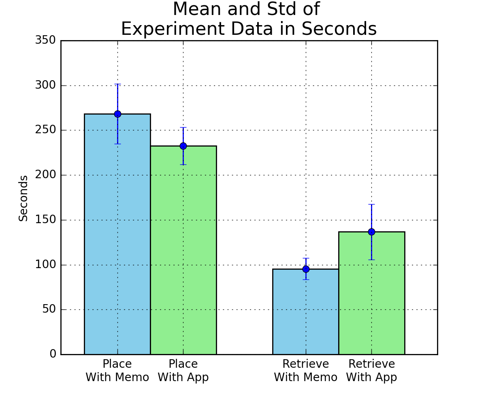

Some people took surprisingly long to retrieve the item (almost the twice as the first retrieving), 
while placing took the same amount of time as the first placing.
This made our application appear hard to use, but you will see later, 
most users stated in the survey that it was easy to use.

## Examples of User Usage
This is an example of the list view and the map view used by a user.
The user placed the items at different locations within the ncs building.

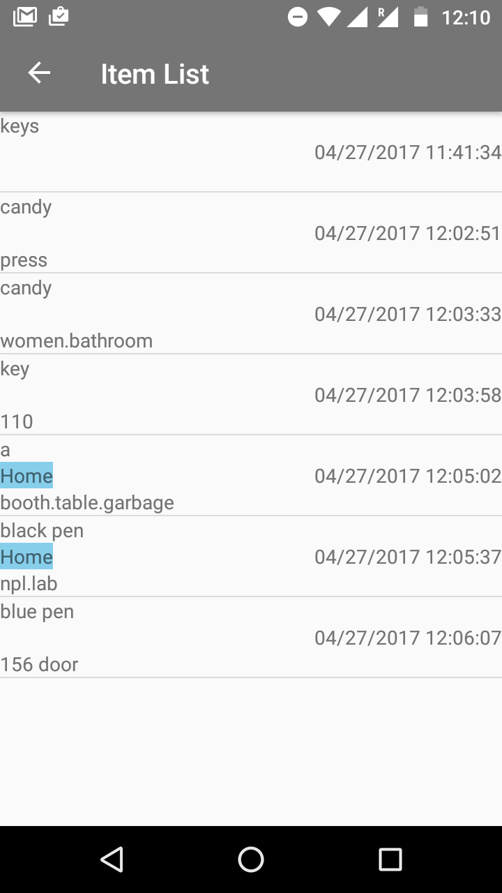 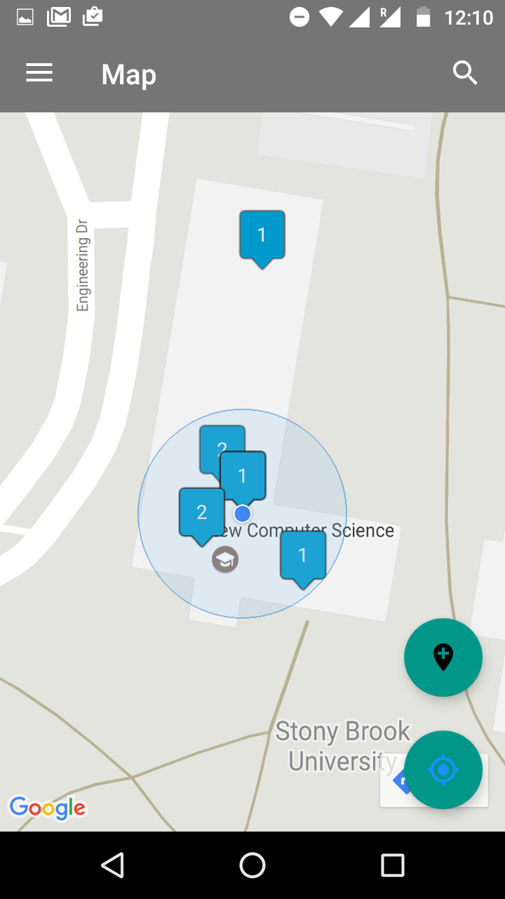

This is another example. All 6 items were placed at the same location because the locations were very close by.

 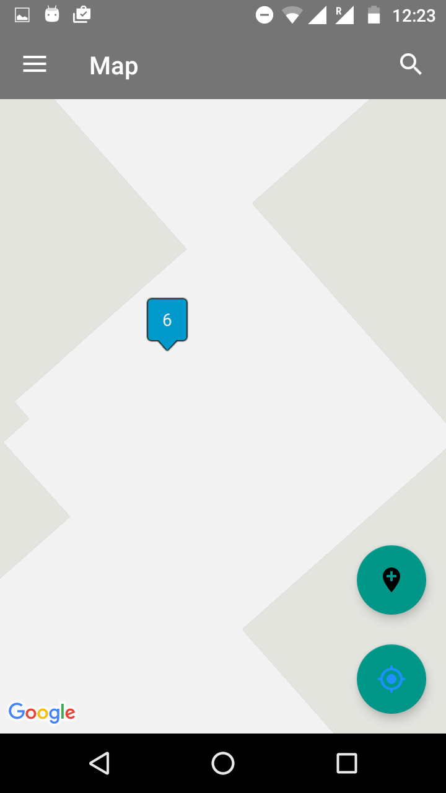

## Male and Female Correlation
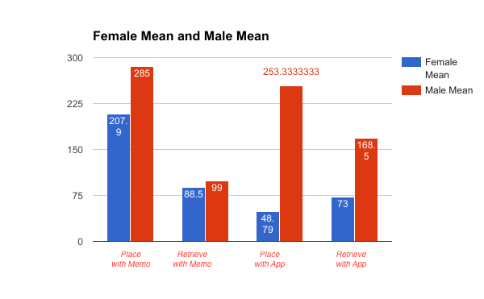
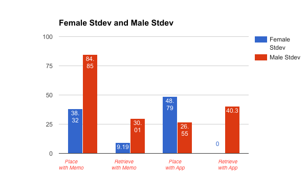

Average time taken by female participants is less that time taken 
by male participants in all four cases, suggesting they are quick in collecting things. 
With the data collected using the survey, we found out that female participant tend not to forget things (less than 25% of the times)
whereas the majority male population tend to forget things often (25%-75% of the times).

## Survey Results
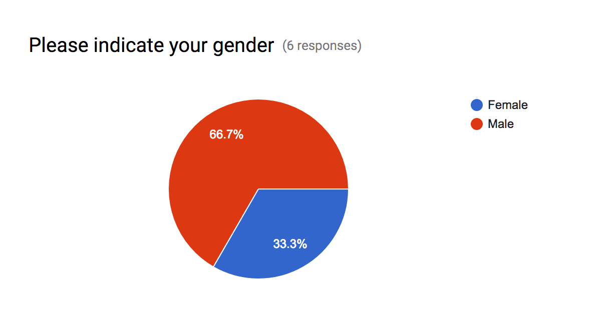

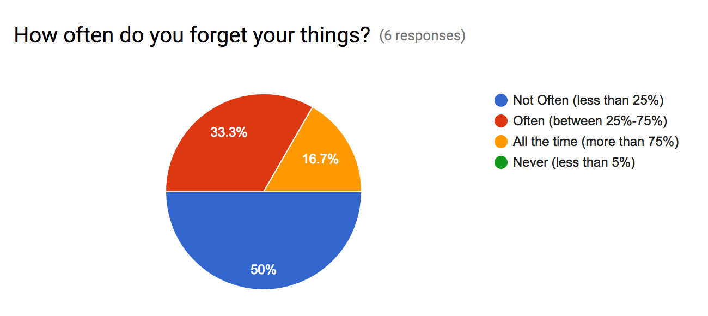

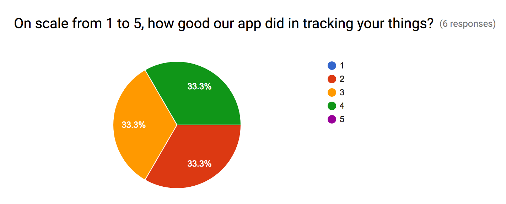

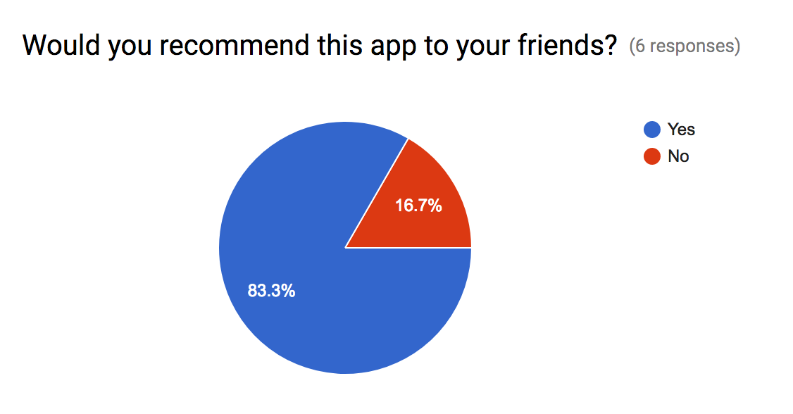

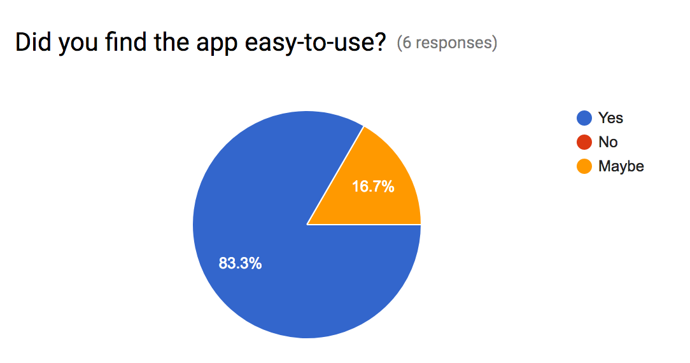

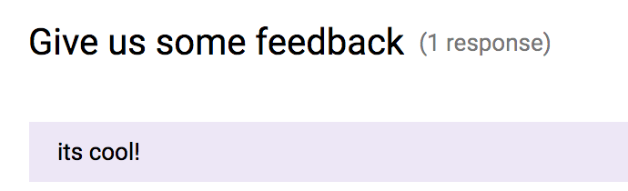

Thanks!

Anjaly & Yeseul
