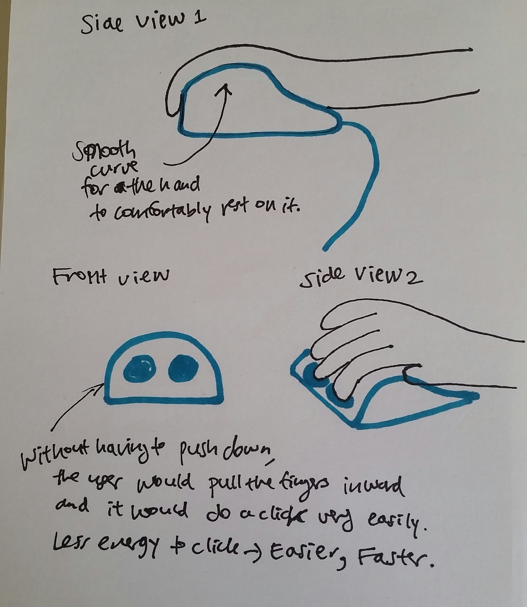
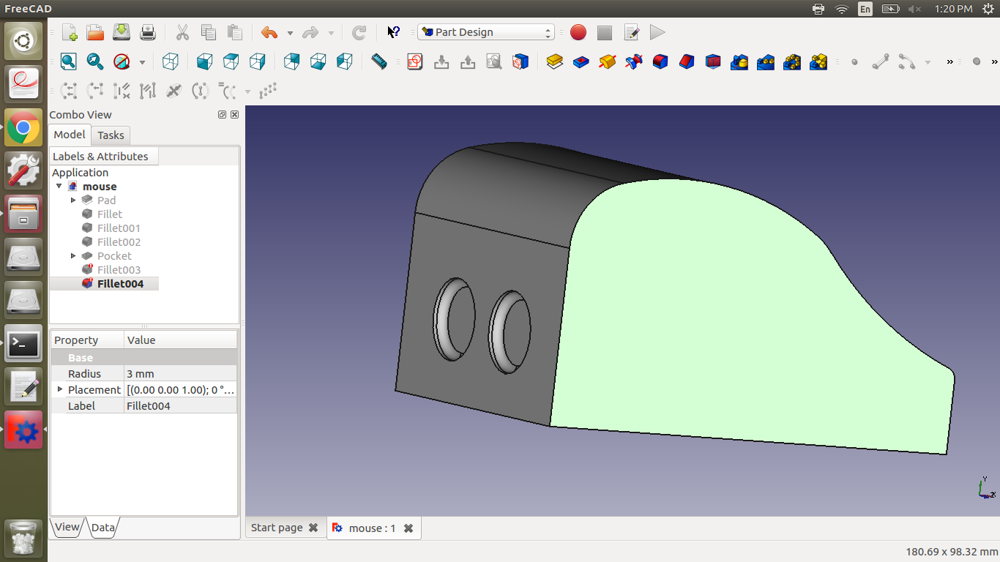
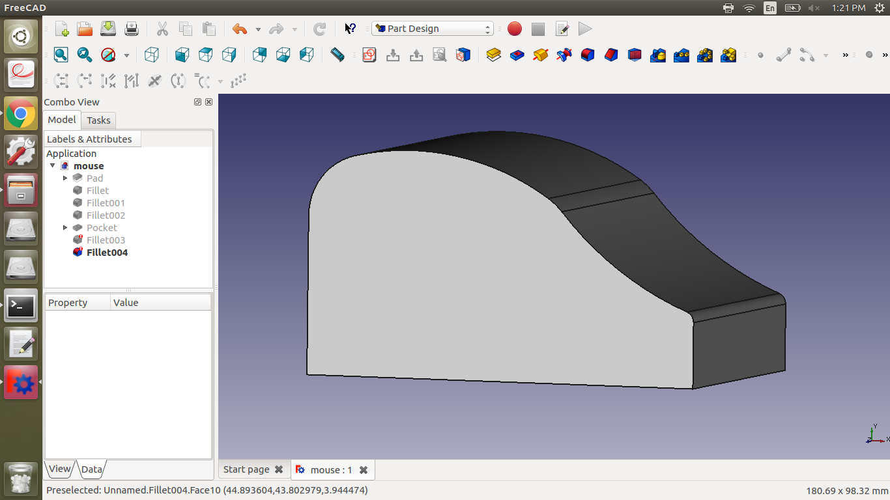
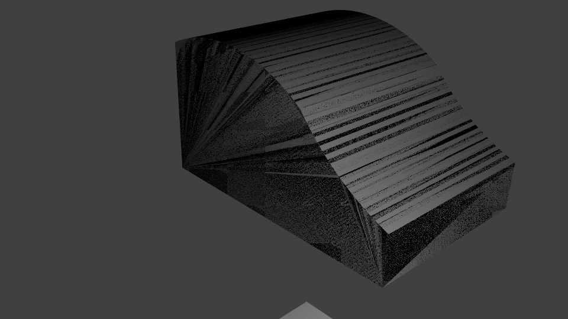

# Assignment 4: Designing and rendering a 3d mouse

I first sketched a mouse I would like. As it says on the sketch, 
I wanted a mouse that my hand can rest on and spend the minimum effort to press a click.
I always saw mouses that I have to press down to click,
but I think pressing in would be interesting and maybe much less effort.

Then I tried to make this in freeCAD.

And I tried also to render it on blender. It was more difficult than I thought.

