# Assignment 7: Software Design 
We made sketches of how our app should look and work like.
After multiple attempts to make a good design, we came up with the following.

There are two main pages for our program: map view and list view.
The user can see their items on the map using gps coordinate points as well as in a list of items in alphabetical order.
Some operations they can perform are searching for the item or the location category (like "Home") and adding or editing an item. 
They may also click on item points on the map and see what is in that location.

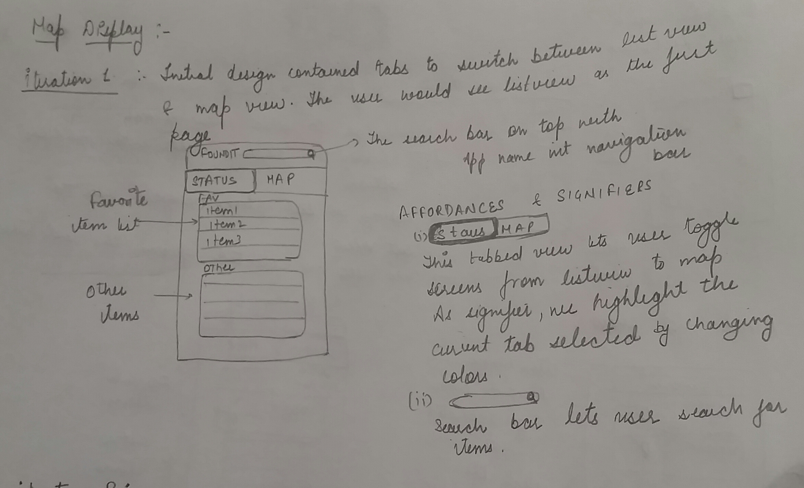
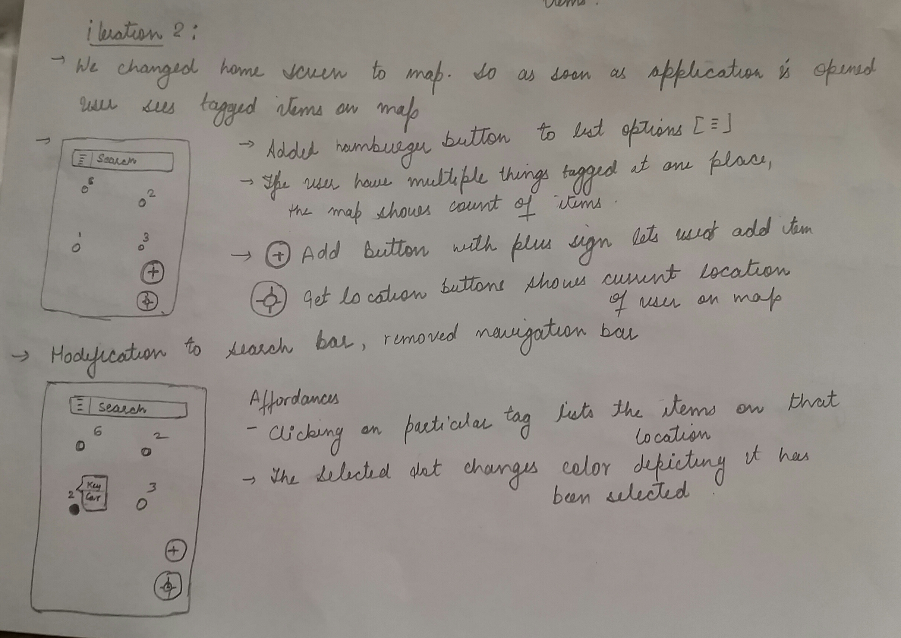
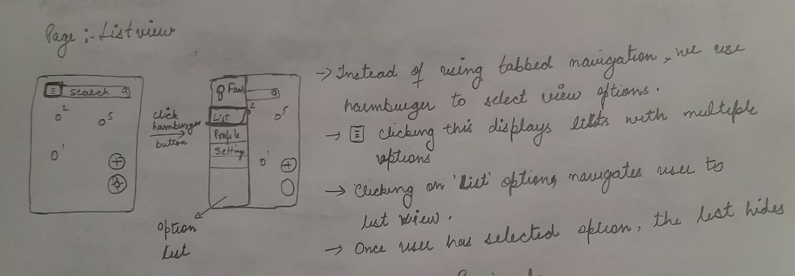
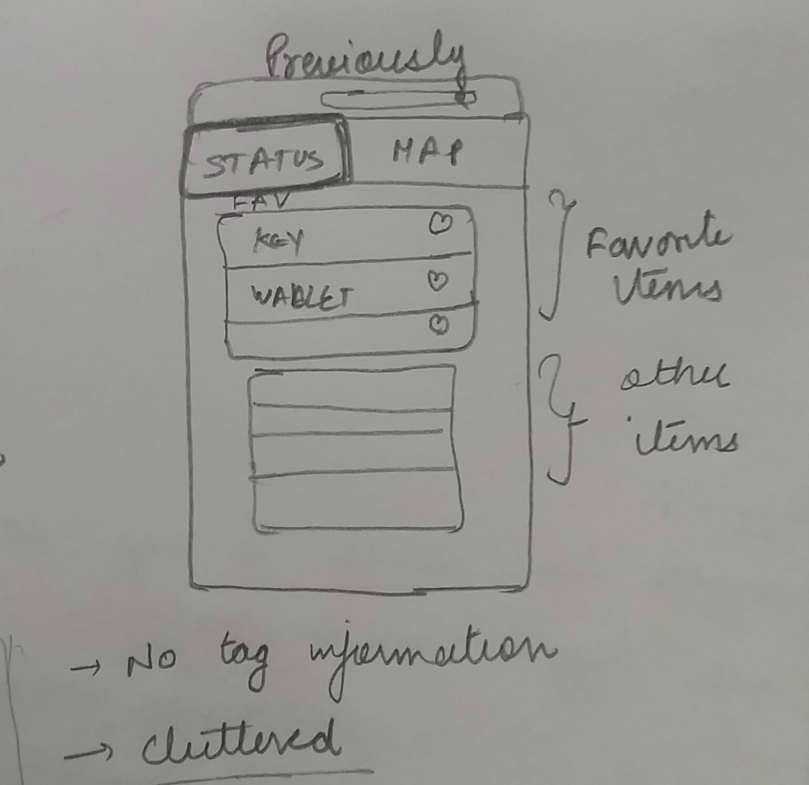
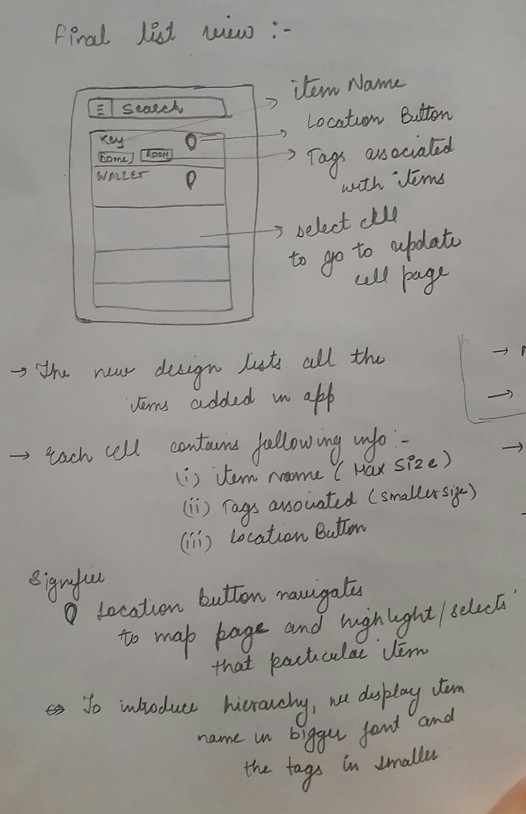
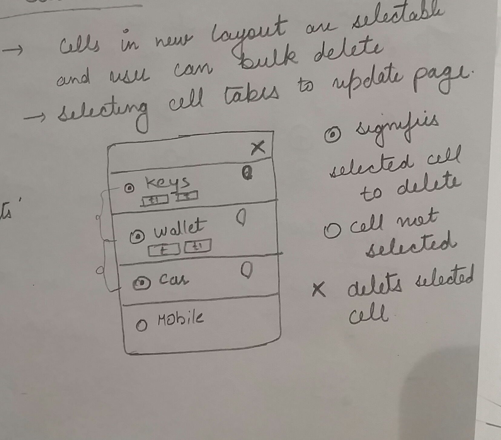
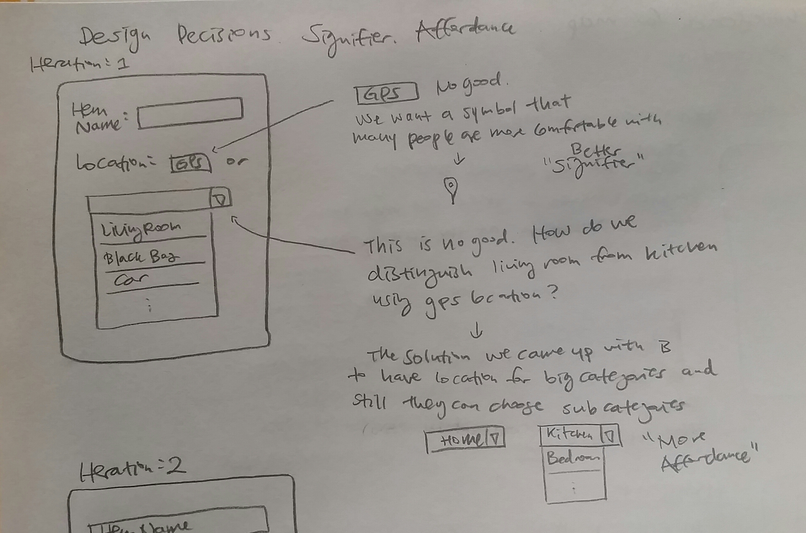
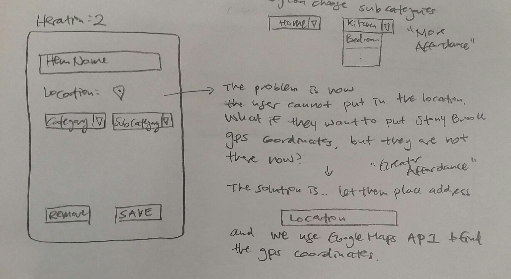
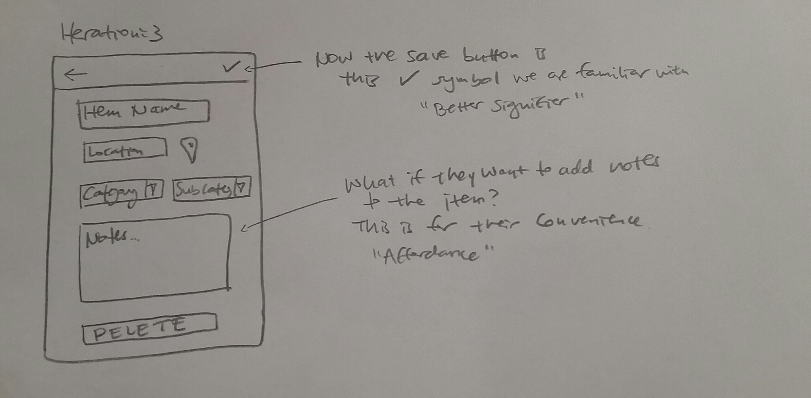
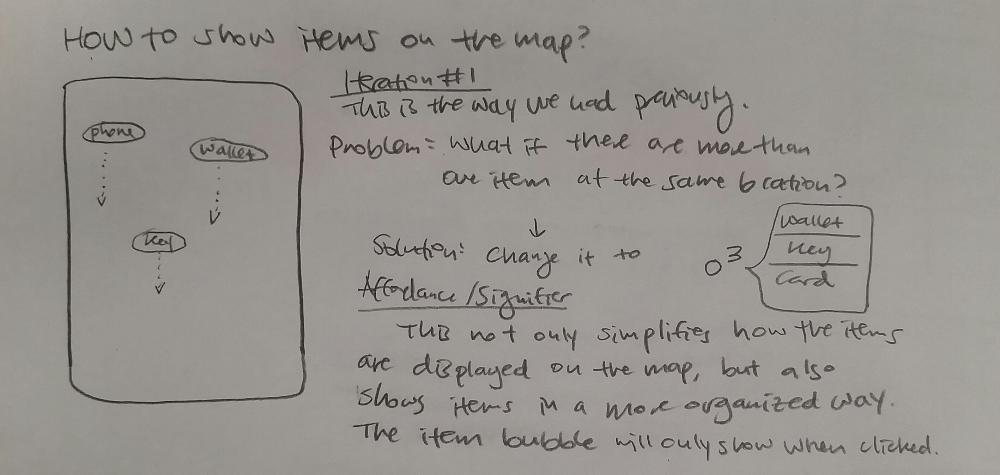
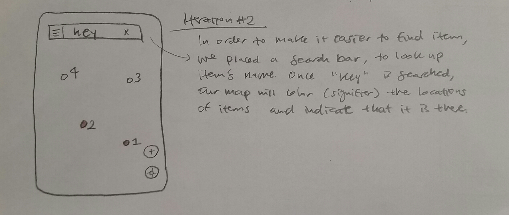
