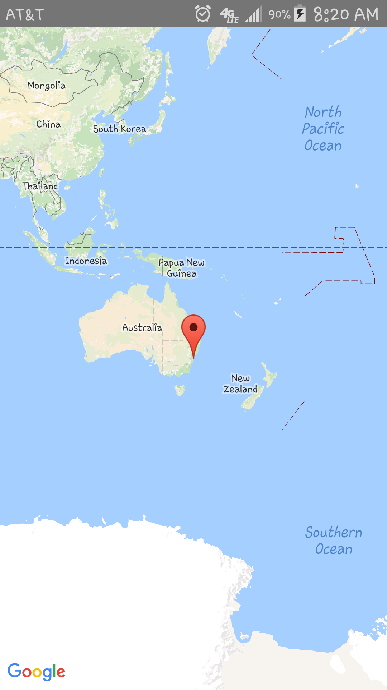
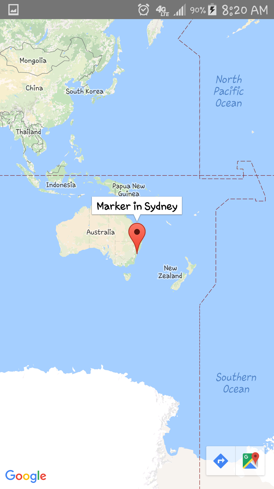
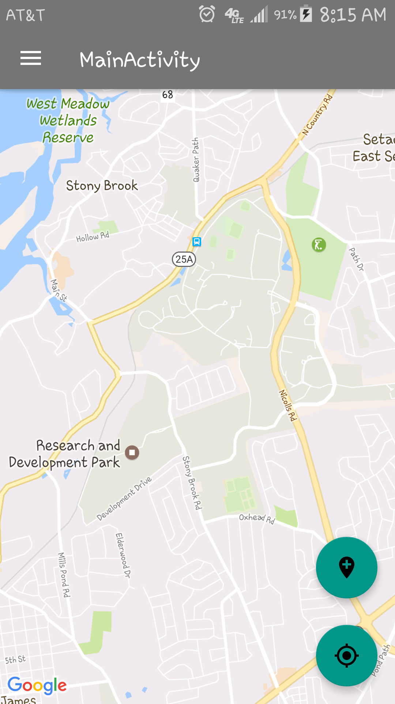
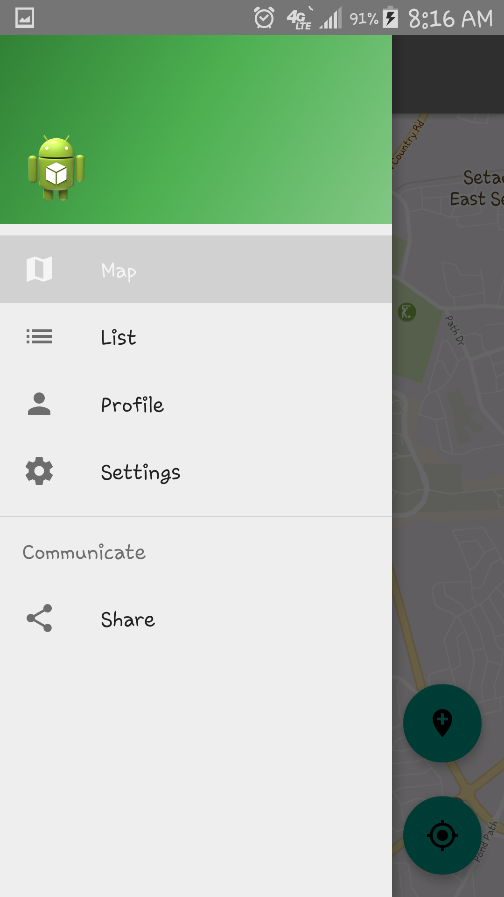

# Assignment 8: Software Prototype

For this assignment, our task was to get the first page (map) done with some buttons and a navigation view. 
So first, we used [google maps api](https://developers.google.com/maps/android/) to get the key and and display the map on our main page.




Then we added the navigation view (which opens up when the user slides the screen from left to right or clicks on the hamburger icon from the header. We also added two floating action buttons: one is for adding an item to the map and another is for showing the user's location.




Moreover, se have developed backend storage using Sqllite database to store information user put in regarding items. It's in-app data storage facility and we created a item table in the db. The table contains 7 columns as defined below. The key_id is the primary key which identifies each item uniquely. 
```Java
String KEY_ID = "id";
String ITEM_NAME = "itemname";
String ITEM_CATEGORY = "itemcategory";
String ITEM_SUBCATEGORY = "itemsubcategory";
String LONGITUDE = "longitude";
String LATITUDE = "latitude";
String ADDRESS = "address";
```
The table stores information of item, category and sub-cateogry, 
longitude and latitude of marked object and address. Every time user
adds and item we create and entry in database and if user decides to 
delete an item, we remove the entry for particular item from this table.

To get the location of user, we use LocationManager package provided by android
We need to access user location so we need to have permissions to do so.
We check if the user has already given us permission, if yes, we  request
location update and store latitude and longitude, if not , we ask user to authorize us to use location

Code Sample :
```Java
ActivityCompat.requestPermissions(this, new String[] {
                Manifest.permission.ACCESS_FINE_LOCATION,
                Manifest.permission.ACCESS_COARSE_LOCATION },1);
```
